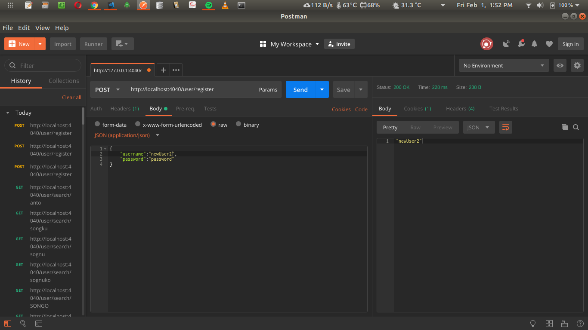
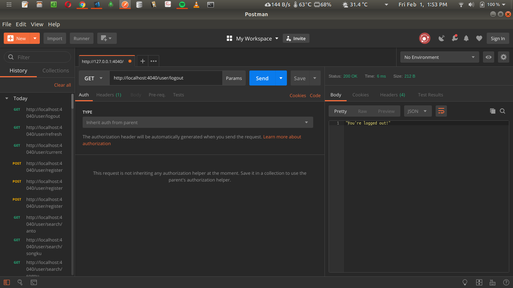
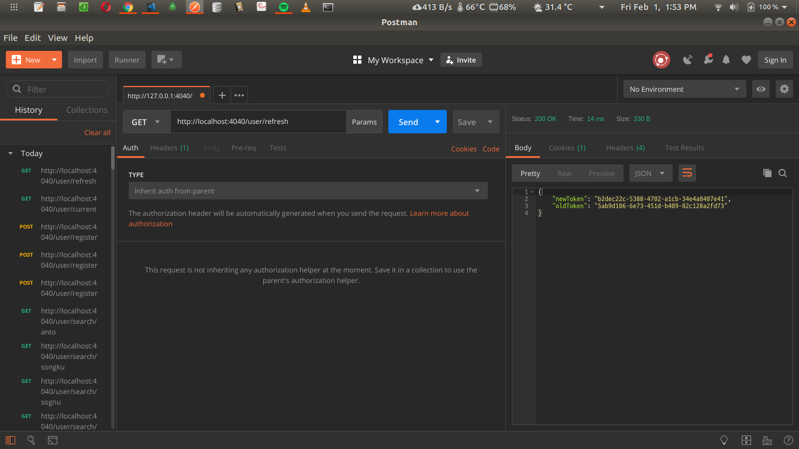
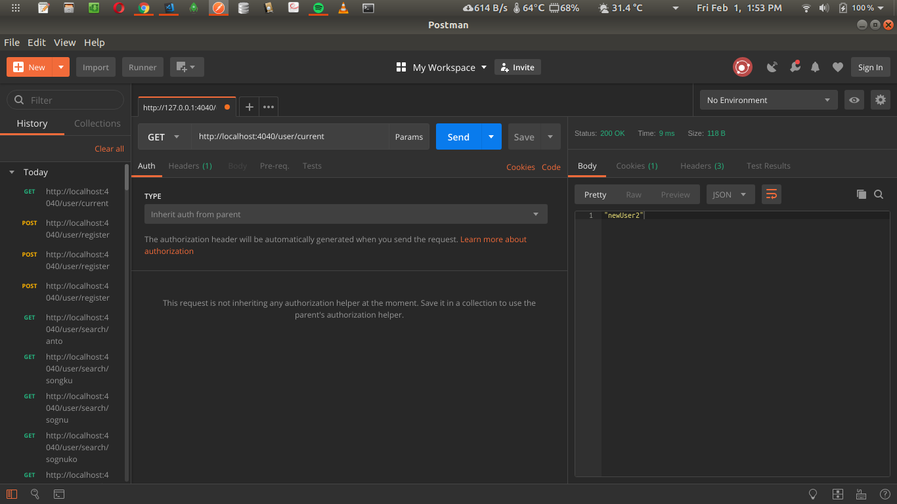
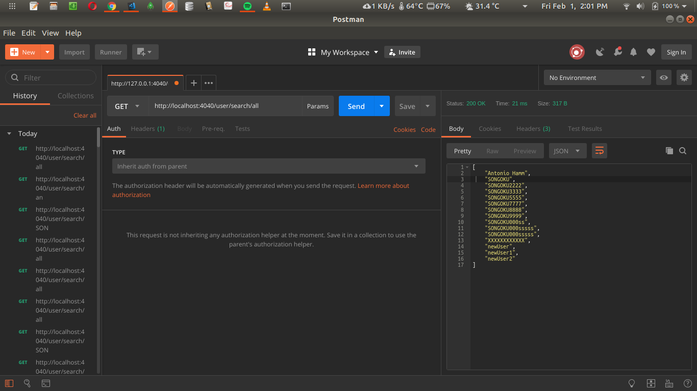
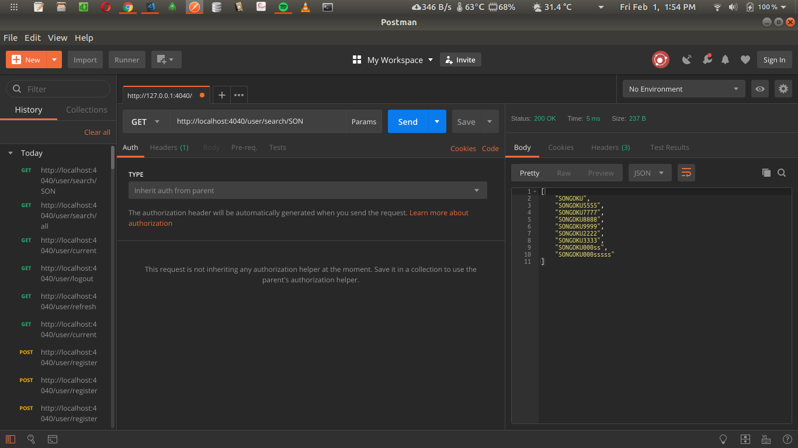

# GOAUTH

Simple authentication server written in GO

API Lists:

- http://localhost:4040/user/register
  Register new user, then logged in
- http://localhost:4040/user/login
  Login user, uses session-based authentication
- http://localhost:4040/user/logout
  Logout
- http://localhost:4040/user/refresh
  Refresh new session token
- http://localhost:4040/user/current
  Return current user info
- http://localhost:4040/user/search/all
  Return all user from database
- http://localhost:4040/user/search/{username}
  Search for a user, fuzzy-search supported

Result images (Postman):

- Register
  
- Login
  
- Logout
  
  
- Refresh
  
- Current
  
- All users
  
- Search user
  

Packages used:

- [Redis](https://github.com/go-redis/redis)
- [Mongo](https://github.com/mongodb/mongo-go-driver)
- [sahilm Fuzzy](https://github.com/sahilm/fuzzy)
- [Goolge UUID](https://github.com/google/uuid)
- [Gorilla Mux](https://github.com/gorilla/mux)
- [Gorilla Handlers](https://github.com/gorilla/handlers)
